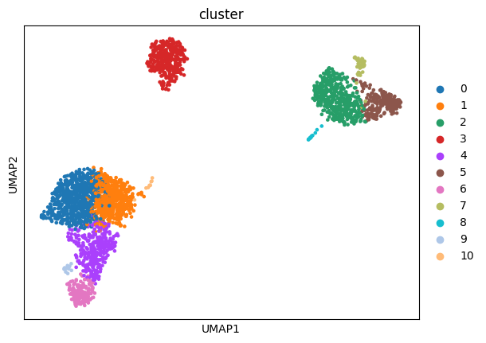
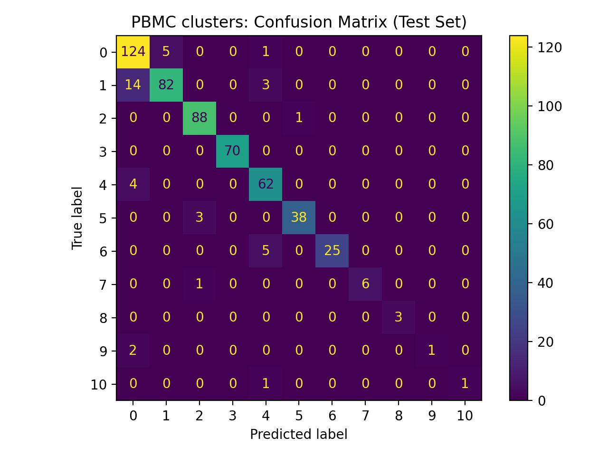
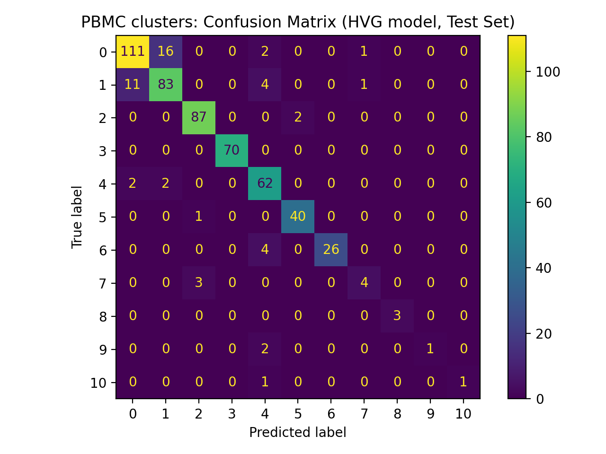
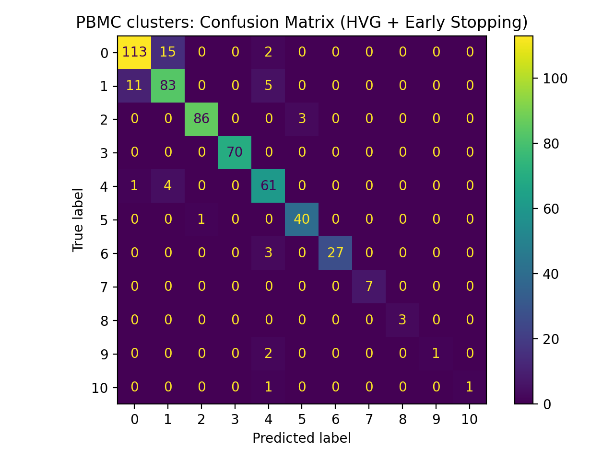

# Single-cell RNA-seq + PyTorch baseline (PBMC3k)

This mini-project demonstrates an end-to-end single-cell RNA-seq analysis and deep learning workflow using Python and PyTorch. The project covers standard preprocessing and clustering of single-cell transcriptomics data with Scanpy, including normalization, highly-variable gene selection, PCA, Leiden clustering, and UMAP visualization. Building on these representations, multiple PyTorch-based classification baselines are implemented and compared, using both low-dimensional PCA embeddings and high-dimensional gene-expression features, with regularization and early stopping to assess generalization.

It emphasizes reproducible workflows, clear evaluation, and model checkpointing, reflecting common practices in applied machine learning research for biological data.

The repository includes both a Python script for fully reproducible execution and a Jupyter notebook version for step-by-step exploration and visualization.

## What it does
- Loads PBMC3k single-cell RNA-seq data (Scanpy)
- Preprocesses: filtering, normalization, log1p, HVG selection
- Computes PCA + neighbors graph, performs Leiden clustering
- Visualizes clusters with UMAP (saved to `figures/`)
- Trains a PyTorch classifier on PCA embeddings to predict cluster IDs
- Evaluates with a confusion matrix (saved to `figures/`)
- Saves trained model weights to `models/`
## Baselines
- PCA baseline: trains a PyTorch classifier on 50-dimensional PCA embeddings (test acc ~0.91)
- HVG baseline: trains a PyTorch classifier directly on 2000 highly-variable gene features with dropout (test acc up to ~0.91; shows overfitting behavior on small data)
- HVG + early stopping: trained a PyTorch classifier on highly-variable genes with dropout and early stopping (best test acc ~0.91)


## How to run

### Option 1: Run the full pipeline (recommended)

```bash
- For a minimal install:
pip install -r requirements-min.txt
- For fully reproducible versions:
pip install -r requirements.txt

python pbmc_scanpy_pytorch_baseline.py
```

### Option 2: Explore interactively

Open pbmc_scanpy_pytorch_baseline.ipynb in Jupyter or VS Code and run the cells sequentially.


## Results

1. ### UMAP clustering
    

2. ### Confusion matrix — PCA baseline
    

3.  ### Confusion matrix — HVG baseline
    
    
4. ### Confusion matrix — HVG with early stopping
    

5. Model checkpoints are saved under `models/` for each baseline (PCA, HVG, HVG + early stopping).
